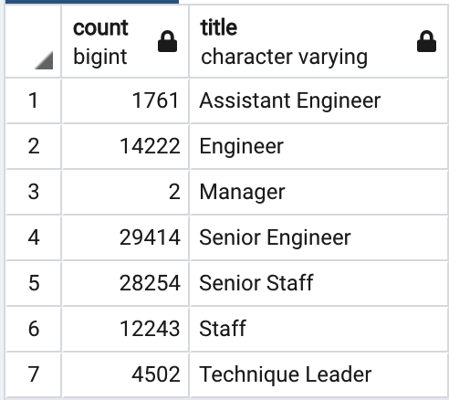
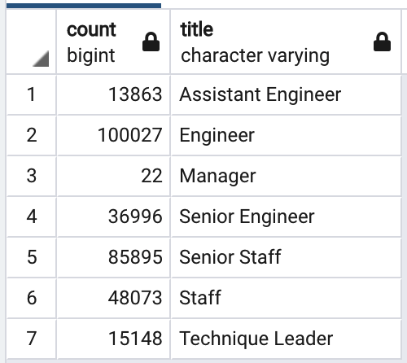

# Pewlett-Hackard-Analysis

## Table of Contents
- [1.0 Introduction](#Introduction)
  * 1.1 Purpose
  * 1.2 Tools
- [2.0 Results](#Results)
  * 2.1 Employees Eligible for Retirement
  * 2.2 Employees Eligible for Mentorship
- [3.0 Summary](#Summary)
  * 3.1 Theater Outcomes by Launch Date
  * 3.2 Outcomes Based on Goals

## 1.0 Introduction

### 1.1 Purpose
Bobby needs to determine the number of employees that are reaching retirement, and determine the number of employees who are eligible to be mentors. 

### 1.2 Tools
  - SQL
 

## 2.0 Results
### 2.1 Employees Eligible for Retirement
   

### 2.2 Employees Eligible for Mentorship
   

## 3.0 Summary

