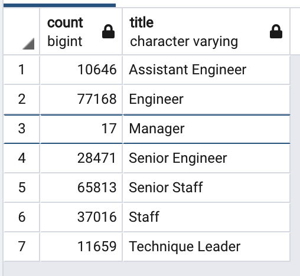

# Pewlett-Hackard-Analysis

## Table of Contents
- [1.0 Introduction](#Introduction)
  * 1.1 Purpose
  * 1.2 Tools
- [2.0 Results](#Results)
  * 2.1 Employees Eligible for Retirement
  * 2.2 Employees Eligible for Mentorship
- [3.0 Summary](#Summary)
  * 3.1 Theater Outcomes by Launch Date
  * 3.2 Outcomes Based on Goals

## 1.0 Introduction

### 1.1 Purpose
Bobby needs to determine the number of employees that are reaching retirement, and determine the number of employees who are eligible to be mentors. The employees that are eligible for retirment were born between 1952 and 1955.  The emplyees eligible to be mentors are born during 1965. 

### 1.2 Tools
  - SQL
 

## 2.0 Results
### 2.1 Employees Eligible for Retirement
- There are a total of 90,398 employees eligible for retirement from the company. 
- Approximately 64% of the employees retiring are in senior positions. 
   

### 2.2 Employees Eligible for Mentorship
- There are a total of 1,360 that are eligible to be mentors. 
- Senior Staff and Engineers are a majority of the employees that are eligible for mentorship.
   

## 3.0 Summary

How many roles will need to be filled as the "silver tsunami" begins to make an impact?

The number of roles that need to be filled is 90,398.  These employees are are eligible to retire within the next 3 years as they were born ebtween 1952 and 1955. These employees have 7 different titles (Manager, Senior Engineer, Engineer, Senior Staff, Staff, Technique, and Assistant Engineer). 

Are there enough qualified, retirement-ready employees in the departments to mentor the next generation of Pewlett Hackard employees?
The number of employees that are eligible to be mentors is 1,360. These employees were born during 1965. There are no managers eligible to become mentors. Pewlett Hackard should expand the age range for employees to become mentors in order to compensate for the 3 year range of eligible employees who can retire. There are 230,790 employees that can already be mentors. This staff was born between 1956 and 1964. with the count of this staff and the incoming staff that are eligible for mentorship, there will be enough mentors to replace the employees that are eligible for retirement. 

